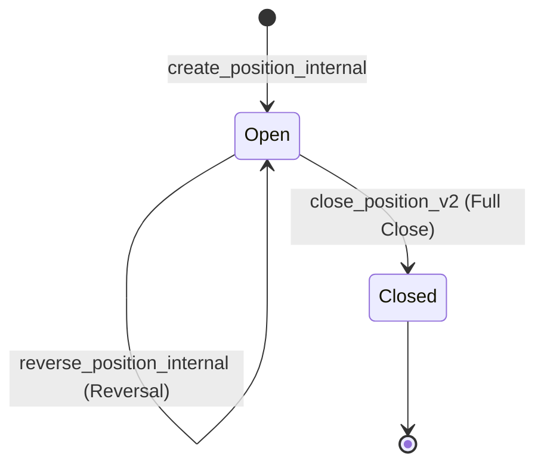

# Position Engine Visual Diagrams & Charts

This document maps out the state transitions and opposite-side netting scenarios of the Position Engine (v1.0.0).

---

## 1. State Machine Diagram



### Transition Flowchart
```text
No Position
    │
    ├── BUY  → Long (Create)
    └── SELL → Short (Create)

Long
    │
    ├── BUY           → Increase (Averaging)
    ├── SELL Partial  → Reduce (Partial Close)
    ├── SELL Equal    → Close (Full Close)
    └── SELL Greater  → Reverse → Short (FIFO Close + opposite side Create)

Short
    │
    ├── SELL          → Increase (Averaging)
    ├── BUY Partial   → Reduce (Partial Close)
    ├── BUY Equal     → Close (Full Close)
    └── BUY Greater   → Reverse → Long (FIFO Close + opposite side Create)
```

---

## 2. Opposite-Side Matching / Netting Scenarios

| Scenario | Current State | Incoming Order | Processed Transitions | Final State |
| :--- | :--- | :--- | :--- | :--- |
| **1. Full Close** | Long 10 | SELL 10 | Close Long 10 | Position Closed |
| **2. Partial Close** | Long 10 | SELL 5 | Reduce Long by 5 | Long 5 remains |
| **3. Reversal** | Long 10 | SELL 20 | Close Long 10 → Open Short 10 | Short 10 |
| **4. Partial Close (Short)**| Short 12 | BUY 4 | Reduce Short by 4 | Short 8 remains |
| **5. Position Creation** | None | BUY 5 | Create Long 5 | Long 5 |
| **6. Same-Side Averaging** | Long 5 | BUY 5 | Increase Long by 5 (Averages Price) | Long 10 |

---

## 3. FIFO Lot Netting Flow

```text
User Portfolio (Oldest first):
[Lot P1: Buy 1 @100] -> [Lot P2: Buy 2 @105] -> [Lot P3: Buy 3 @110]

SELL Order (size = 4):
1. Consume P1 (1 lot)  --> Close P1 (Remaining order qty = 3)
2. Consume P2 (2 lots) --> Close P2 (Remaining order qty = 1)
3. Consume P3 (1 lot)  --> Reduce P3 by 1 (Remaining order qty = 0)

Final open portfolio:
[Lot P3: Buy 2 @110]
```
