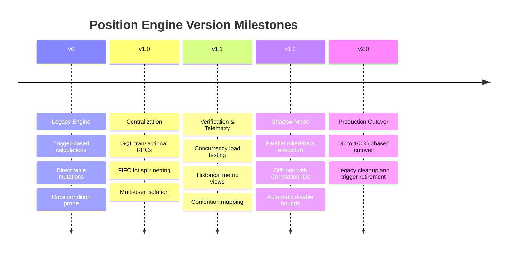

# Engine Evolution & Timeline Spec

This timeline captures the transition milestones of the MarginApex Position Engine architecture.

---

## 1. Engine Evolution Path

---

## 2. Release & Version Scope

- **v1.0.0 (Hard Freeze)**:
  - Centralized financial validation inside Postgres transaction blocks.
  - Eliminated TS-side margin/brokerage checking math duplicate logic.
  - Enforced `place_order_v2` and `close_position_v2` as authoritative API boundaries.
- **v1.1.0 (Telemetry & Load)**:
  - Historical `rpc_metrics` logging table.
  - Concurrency load tests (Vitest Scenarios 1-5).
  - Telemetry views for locks, recon, and index efficiency.
- **v1.2.0 (Shadow Mode)**:
  - Sub-transaction rollback runner (`run_shadow_order_v2`).
  - Correlation ID comparison framework and mismatch logging.
