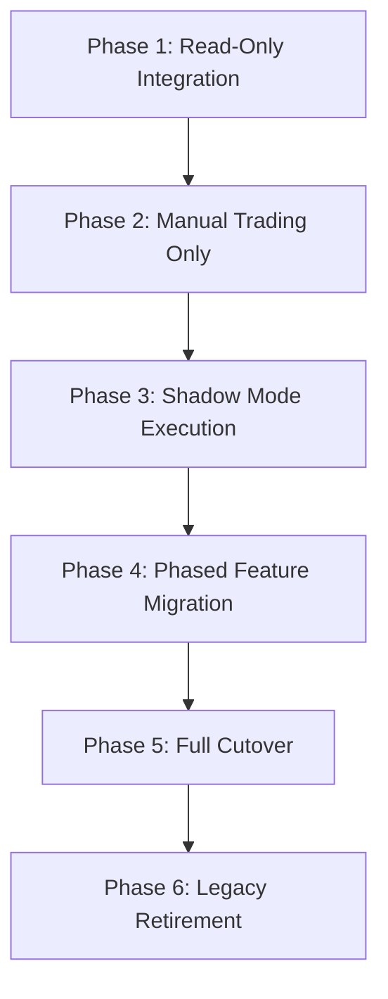

# Strangler Fig Migration & Adoption Plan (v1.0.0)

This document maps out the phased adoption roadmap and integration checklist to migrate the application service layers to the new **Position Engine (v1.0.0)** with zero downtime and minimal risk.

---

## 1. Strangler Fig Adoption Roadmap

### Phase 1: Read-Only Integration (0% Financial Risk)
- **Goal:** Verify that the new model yields the same positions, P&L, and balance data as legacy views.
- **Action:** Transition read-only endpoints and UI components (Cumulative Positions, Detailed Positions, Order History, Wallet Balances) to query the new tables/views.

### Phase 2: Manual Trading Only
- **Goal:** Limit write adopts strictly to user-initiated manual trades.
- **Action:** Point manual BUY/SELL orders to `place_order_v2` and manual exit clicks to `close_position_v2`. Keep automated engines (Stop Loss, Targets) on the legacy path.

### Phase 3: Shadow Mode Simulation
- **Goal:** Compare real-world engine behavior side-by-side without mutating live state.
- **Action:** For every manual order:
  1. Execute order on the Legacy Engine (commits changes).
  2. Run the same order on the Position Engine v2 inside a rolled-back transaction context.
  3. Compare outputs (quantity, average price, realized P&L, locked margin, brokerage) and log discrepancies.

### Phase 4: Phased Feature Migration
- **Goal:** Migrate automated backend workflows one-by-one.
- **Action:** Transition execution systems in isolation. Never migrate multiple paths simultaneously:
  1. Stop Loss Execution
  2. Target Execution
  3. GTT Triggering
  4. Auto Square-Off
  5. Liquidation Engine
  6. Admin Settlement & EOD Processing

### Phase 5: Full Cutover
- **Goal:** Decommission all legacy write paths.
- **Action:** Route all traffic exclusively to the v2 engine after achieving zero shadow-mode mismatches and stable production telemetry.

### Phase 6: Legacy Retirement
- **Goal:** Simplify schema and codebase.
- **Action:** Remove legacy RPC functions, compatibility GUC flags, bypass trigger logic, and obsolete schemas.

---

## 2. Financial Write Authority Checklist

To prevent alternate write paths and guarantee a single source of truth, verify each migration target:

| Component / Workflow | Current Target | Desired Target | Status |
| :--- | :--- | :--- | :--- |
| **Manual BUY** | `place_order` | `place_order_v2` | ⬜ Pending |
| **Manual SELL** | `place_order` | `place_order_v2` | ⬜ Pending |
| **Manual EXIT** | `close_position` | `close_position_v2` | ⬜ Pending |
| **Stop Loss Execution** | Legacy trigger | `close_position_v2` | ⬜ Pending |
| **Target Execution** | Legacy trigger | `close_position_v2` | ⬜ Pending |
| **GTT Execution** | Legacy trigger | `place_order_v2` | ⬜ Pending |
| **Liquidation Engine** | Legacy trigger | `close_position_v2` | ⬜ Pending |
| **Auto Square-Off** | Legacy trigger | `close_position_v2` | ⬜ Pending |
| **Admin Settlement** | Legacy trigger | `close_position_v2` | ⬜ Pending |

---

## 3. Operational Telemetry & Monitoring

During the initial 72 hours of live traffic, monitor:
- **Lock Wait Time:** DB lock durations on `profiles` and `positions`.
- **Deadlock Rates:** Deadlocks caught and resolved.
- **Serialization Failures:** Rollbacks due to concurrent conflict.
- **SLA Latency:** P95/P99 execution times for `place_order_v2`.
- **Reconciliation Deltas:** Profile balances vs ledger transaction sums.
